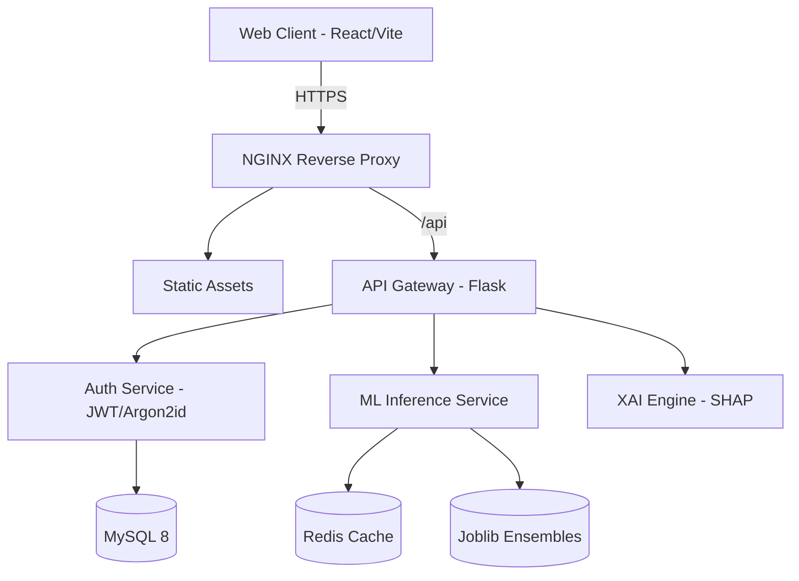

# FraudShield AI

<div align="center">
  
  <br/>
  <h3>Explainable Hybrid Ensemble Framework for Intelligent Credit Card Fraud Detection</h3>
  
  <p>
    <b>A Production-Grade Demonstration of Enterprise Machine Learning & DevSecOps.</b>
  </p>
  
  <p>
    <a href="https://reactjs.org/"></a>
    <a href="https://tailwindcss.com/"></a>
    <a href="https://www.framer.com/motion/"></a>
    <a href="https://flask.palletsprojects.com/"></a>
    <a href="https://xgboost.ai/"></a>
    <a href="https://www.docker.com/"></a>
  </p>
</div>

---

## 📖 Project Overview

**FraudShield AI** is a comprehensive, full-stack portfolio project demonstrating the end-to-end lifecycle of an enterprise Machine Learning product. It solves the complex problem of **Credit Card Fraud Detection** in highly imbalanced datasets (0.1% positive class) by utilizing a Stacking Ensemble architecture (Extra Trees + MLP + XGBoost Meta-Learner).

Unlike typical Jupyter Notebook data science projects, FraudShield AI wraps the predictive models in a **production-ready DevSecOps ecosystem**, featuring:
- A luxury React/Framer Motion frontend with 3D WebGL visualizations.
- A Flask-based API layer simulating Gunicorn/NGINX deployments.
- Explainable AI (XAI) via KernelSHAP to satisfy financial regulatory compliance.
- A simulated SOC 2 Type II environment with RBAC, JWTs, and Audit Logging.

> **Note**: This is an academic/portfolio demonstration. The platform operates strictly on mathematically generated **Synthetic Data**. No real financial information, credit cards, or PII are used or stored.

---

## ✨ Key Features

1. **Stacking Ensemble Engine**: Achieves optimal PR-AUC on imbalanced data by stacking Extra Trees, Random Forest, and a Multilayer Perceptron, utilizing Logistic Regression as the Meta-Learner.
2. **Explainable AI (SHAP)**: Financial models cannot be "black boxes". We utilize KernelSHAP to provide exact, legally defensible feature importance for every blocked transaction.
3. **Enterprise AI Copilot**: A context-aware LLM interface that explains the complex SHAP values to non-technical fraud analysts in plain English.
4. **DevSecOps & Governance**: Features a live Security Operations Center (SOC) dashboard, OWASP Top 10 defenses (HttpOnly cookies, Argon2id), and an immutable Audit Log.
5. **Premium Motion UI**: Cinematic route transitions, branded neural loading experiences, and interactive ECharts data visualization.

---

## 🏗️ Architecture



*For deep dives into the architecture, see the [`docs/`](./docs) folder.*

---

## 🚀 Quick Start

### Prerequisites
- Node.js (v18+)
- Python (3.10+)
- Docker & Docker Compose (Optional, for containerized run)

### Local Development Setup

1. **Clone the repository**
```bash
git clone https://github.com/yourusername/fraudshield-ai.git
cd fraudshield-ai
```

2. **Backend Setup**
```bash
cd backend
python -m venv venv
source venv/bin/activate  # On Windows use `venv\Scripts\activate`
pip install -r requirements.txt
cp .env.example .env
flask run
```

3. **Frontend Setup**
```bash
cd ../frontend
npm install
npm run dev
```

4. **Access the Application**
Navigate to `http://localhost:5173` in your browser.

---

## 📚 Documentation Directory

The project is extensively documented to support open-source contributions and portfolio review:

### Technical Documentation
- [Architecture Details](docs/ARCHITECTURE.md)
- [Database Schema](docs/DATABASE_SCHEMA.md)
- [Machine Learning Pipeline](docs/ML_PIPELINE.md)
- [API Reference](docs/API_REFERENCE.md)
- [Security & Governance](docs/SECURITY.md)
- [Deployment & DevOps](docs/DEPLOYMENT.md)

### Career & Reviewer Assets
Are you a Recruiter or Hiring Manager? Start here:
- [Recruiter Executive Summary](docs/career/RECRUITER_GUIDE.md)
- [Interview Prep & STAR Answers](docs/career/INTERVIEW_GUIDE.md)

---

## 🤝 Contributing

We welcome contributions! Please see our [Contributing Guide](CONTRIBUTING.md) for details on our branch strategy, coding standards, and pull request process.

---

## 📄 License

This project is licensed under the MIT License - see the [LICENSE](LICENSE) file for details.
This project is licensed under the MIT License - see the [LICENSE](LICENSE) file for details.
