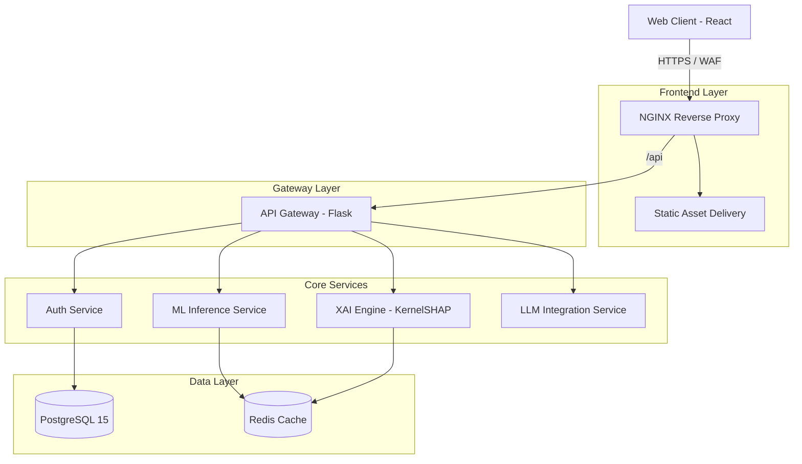
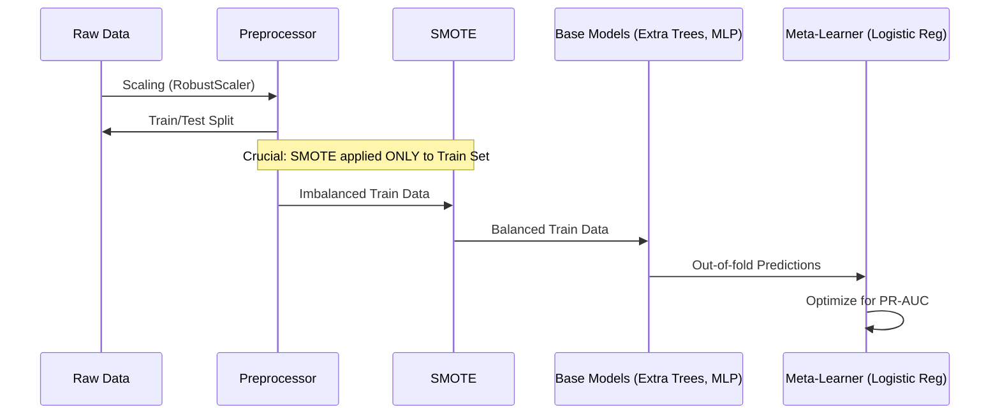

# Architecture

FraudShield AI utilizes a modern, decoupled microservices architecture designed to simulate an enterprise DevSecOps environment.

## High-Level System Architecture

## Frontend Architecture
- **Framework**: React 18 + Vite for lightning-fast HMR and optimized builds.
- **Styling**: Tailwind CSS for utility-first styling, ensuring a consistent design system.
- **Motion & 3D**: `framer-motion` for cinematic page transitions and micro-interactions. `@react-three/fiber` for rendering the complex WebGL globes and particles.
- **State Management**: Context API for global states (Academic Mode, Theme) and React Query for server state caching and optimistic UI updates.

## Backend Architecture
- **Framework**: Flask (Python) served via Gunicorn.
- **Concurrency**: Gunicorn runs with asynchronous workers to handle long-running ML inference requests without blocking the event loop for auth requests.
- **Security**: 
  - JWTs are generated via `PyJWT` and signed with HS256.
  - Refresh tokens are stored strictly in `HttpOnly, SameSite=Strict` cookies to prevent XSS exfiltration.

## Machine Learning Pipeline (Training Architecture)

## Deployment Architecture
See [DEPLOYMENT.md](DEPLOYMENT.md) for specifics on Docker containerization and CI/CD pipelines.
