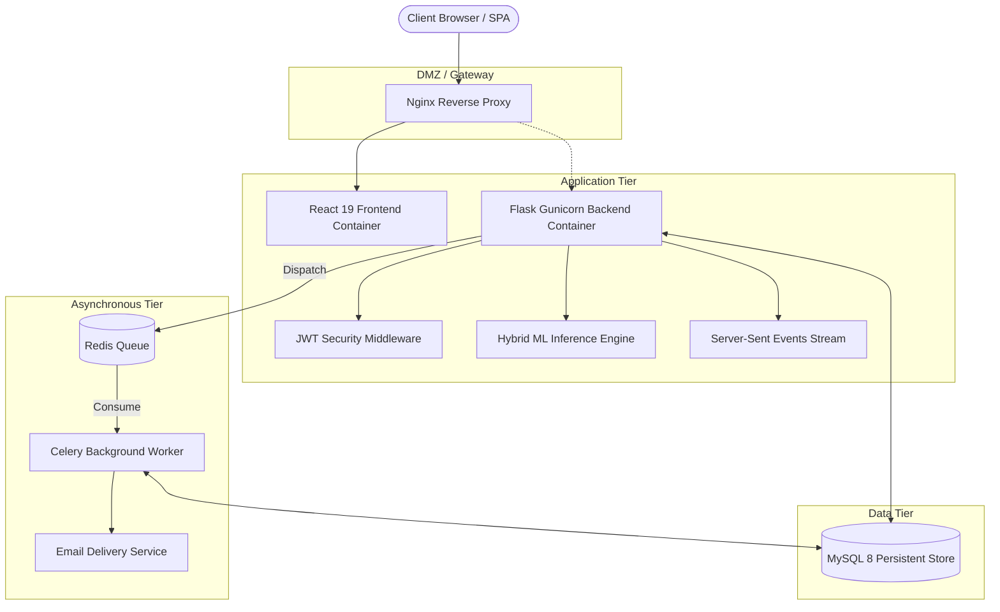
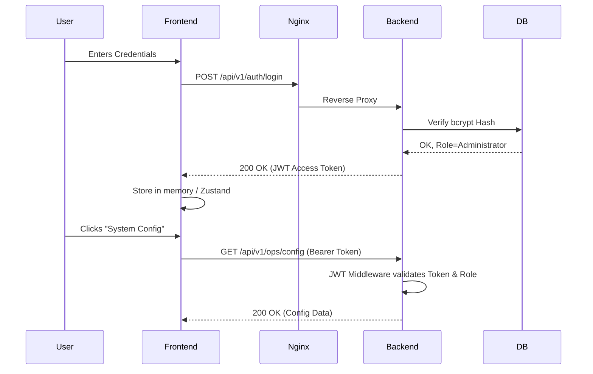

# System Architecture

FraudShield AI leverages a modern, decoupled Cloud-Native architecture designed for horizontal scalability, high availability, and real-time inference.

## Macro Component Layout



## Authentication & RBAC Flow



## ML Inference Pipeline Flow

```mermaid
graph LR
    Raw[Raw Transaction] --> Scale[StandardScaler]
    Scale --> SMOTE[SMOTE Balancing (Training Only)]
    Scale --> ExtraTrees[Extra Trees Classifier]
    Scale --> XGB[XGBoost Classifier]
    Scale --> MLP[Keras MLP Neural Net]
    ExtraTrees --> Meta[Meta-Ensemble Router]
    XGB --> Meta
    MLP --> Meta
    Meta --> Isotonic[Isotonic Calibration]
    Isotonic --> Prob[Final Probability %]
    Prob --> SHAP[SHAP TreeExplainer]
    SHAP --> Visual[Explainability Visualizer]
```

## Technology Justifications

1. **Vite + React 19**: Chosen for near-instant HMR (Hot Module Replacement) and massive reductions in production bundle sizes compared to CRA.
2. **Flask + Gunicorn**: A lightweight microframework that doesn't force ORM bloat, allowing precise integration with heavy numerical libraries (Pandas, scikit-learn).
3. **Redis + Celery**: By offloading SMTP handshakes and Batch ML processing to Celery, the primary Flask threads remain unblocked, ensuring API latency remains under 100ms.
