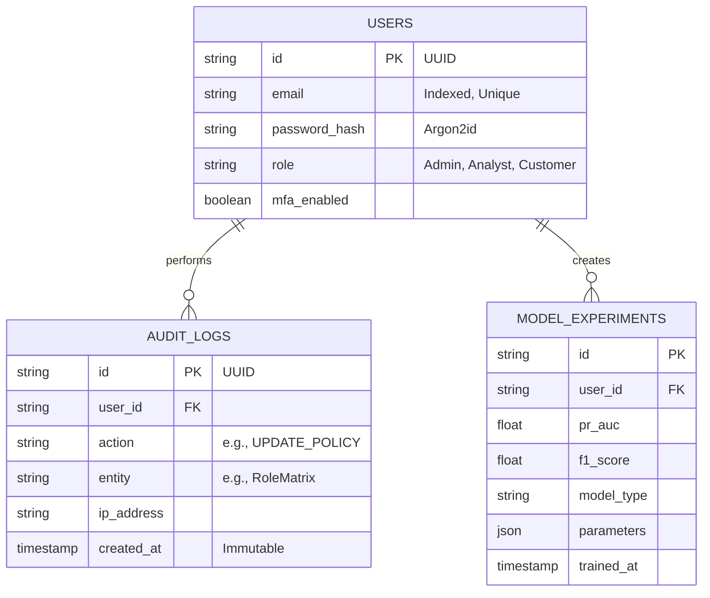

# Database Schema

FraudShield AI utilizes PostgreSQL as its primary persistent storage for configuration, audit logs, and MLOps metrics. High-velocity temporary data (like rate limiting and session tokens) is stored in Redis.

## Entity Relationship Diagram

## Security Constraints
- **Passwords**: Stored exclusively as Argon2id hashes with random salts.
- **Immutability**: The `AUDIT_LOGS` table is append-only. Hard deletes are prevented at the application level to ensure SOC 2 compliance.
- **PII**: No real credit card numbers or raw transaction data are stored in this database. This is strictly a configuration and governance database.
