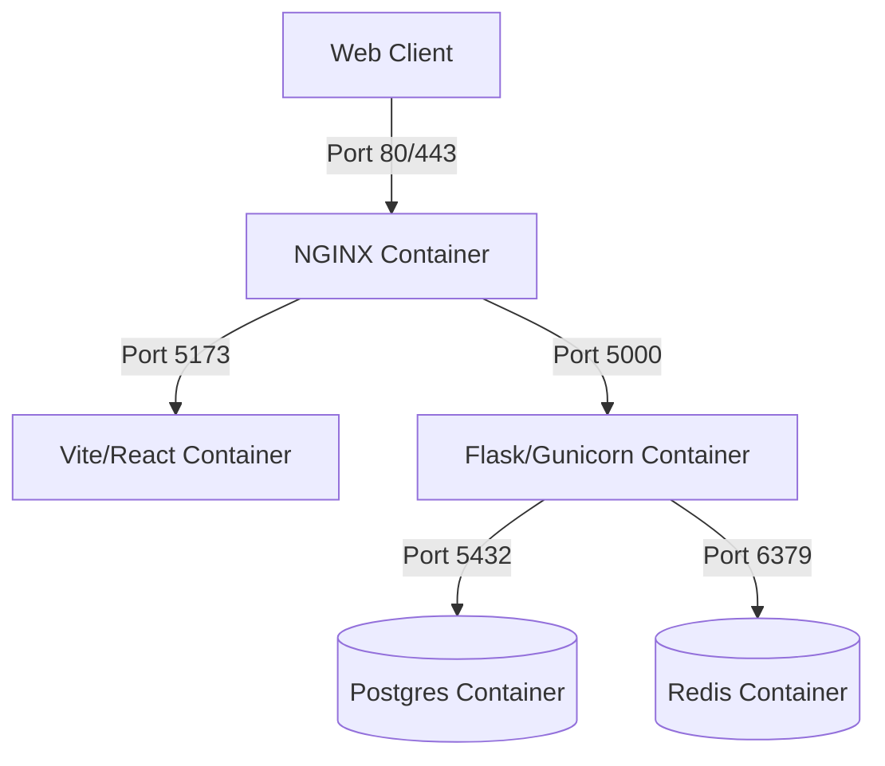

# Deployment & DevOps

FraudShield AI is designed to be easily containerized and deployed using standard DevOps methodologies.

## CI/CD Pipeline

We utilize GitHub Actions for continuous integration.
1. **Linting**: ESLint for React, Black/Flake8 for Python.
2. **Type Checking**: TypeScript `tsc --noEmit`.
3. **Tests**: Pytest for backend unit tests.
4. **Build**: Docker images are built and tagged.

## Docker Containerization

The application is split into multiple services orchestrated by `docker-compose`.



### Key Docker Optimizations
- **Multi-stage Builds**: The React frontend uses a multi-stage `Dockerfile` to build the static assets via Node, and then serves them via a lightweight NGINX Alpine image, drastically reducing the final image size.
- **Environment Variables**: No secrets are baked into the images. They are passed via `.env` files to the containers at runtime.
- **Graceful Shutdown**: Gunicorn is configured to handle `SIGTERM` signals from Docker, allowing it to finish processing current prediction requests before shutting down, ensuring zero downtime during deployments.

## Running in Production Mode (Simulated)

To run the full stack locally via Docker:

```bash
docker-compose up --build -d
```

This will spin up:
- The Postgres Database.
- The Redis Cache.
- The Flask API (with Gunicorn workers).
- The React Frontend.
