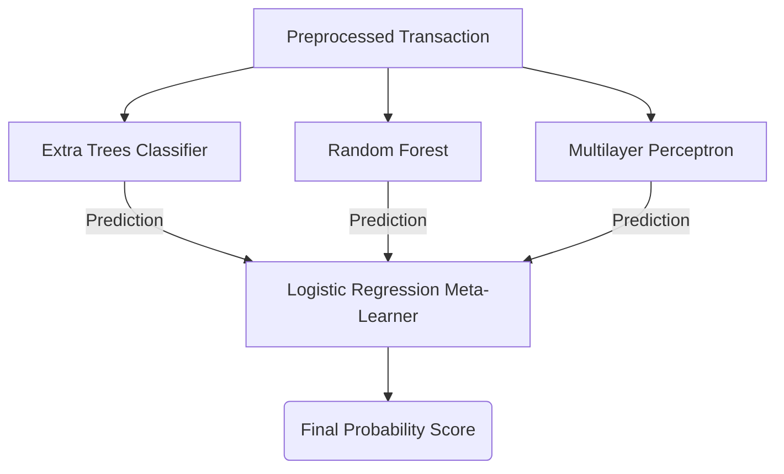

# Machine Learning Pipeline

The core engine of FraudShield AI is designed specifically to handle highly imbalanced datasets (e.g., 0.17% positive class), a common scenario in financial fraud detection.

## 1. Data Preprocessing & Balancing

### Robust Scaling
Because transaction amounts and time can have massive outliers, we utilize `RobustScaler` (which uses the interquartile range) rather than standard scaling to prevent outliers from skewing the model weights.

### SMOTE (Synthetic Minority Over-sampling Technique)
To handle the severe class imbalance, we generate synthetic fraud examples using SMOTE.
**Critical Architecture Decision**: SMOTE is applied *strictly* to the training set during cross-validation. Applying SMOTE before splitting the data would cause severe data leakage, artificially inflating the test scores.

## 2. Stacking Ensemble Architecture

Instead of relying on a single algorithm, we use a **Stacking Classifier**.

1. **Extra Trees**: Highly randomized, excellent for reducing variance.
2. **Random Forest**: Strong baseline tabular data performer.
3. **Multilayer Perceptron (MLP)**: Captures complex non-linear relationships that tree-based models might miss.
4. **Logistic Regression (Meta)**: Learns which base model to trust in specific scenarios.

### Why optimize for PR-AUC?
Traditional ROC-AUC is misleading on imbalanced datasets because a model can achieve a high score simply by guessing the majority class correctly. We explicitly optimize for **Precision-Recall Area Under Curve (PR-AUC)**, prioritizing the accurate identification of the minority class (fraud).

## 3. Explainable AI (XAI)

In regulated financial environments, models cannot be black boxes.
- We implement **KernelSHAP** to analyze the ensemble's decision.
- When a transaction is blocked, SHAP calculates the marginal contribution of each feature (`V14`, `Amount`, etc.).
- This output is visualized in the Fraud Analyst Workspace and fed into our LLM Copilot to generate human-readable narratives.
