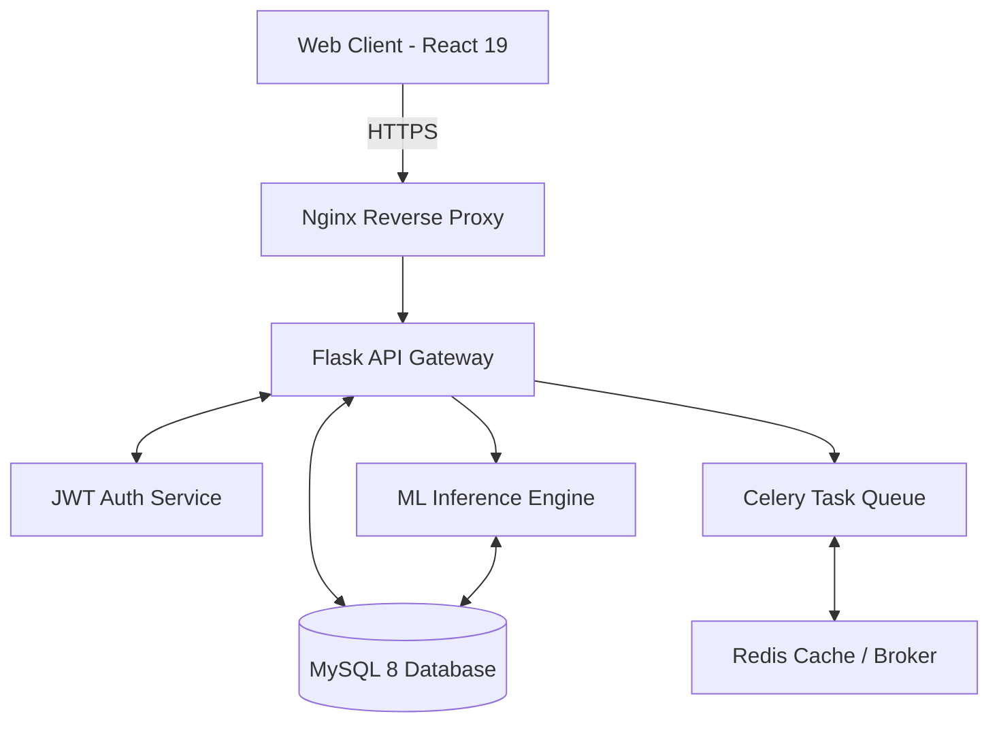
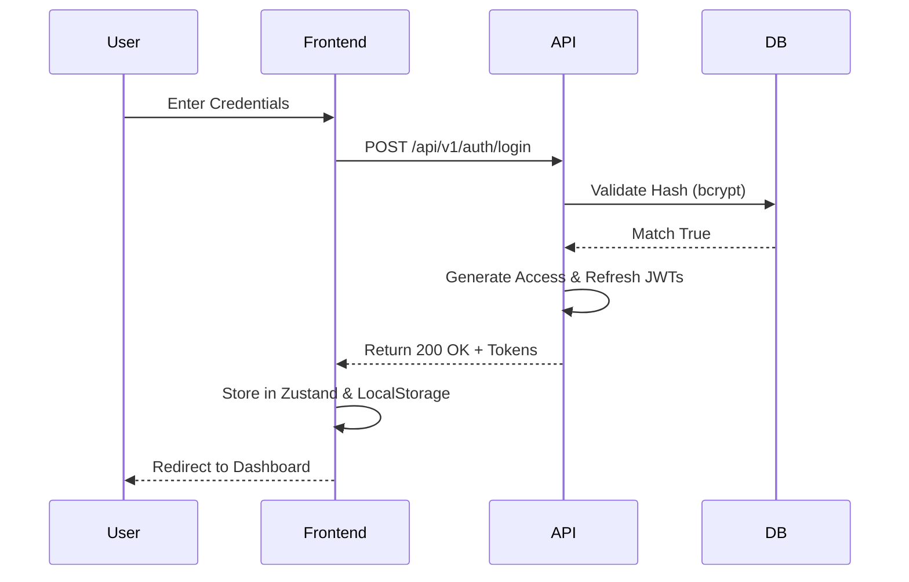
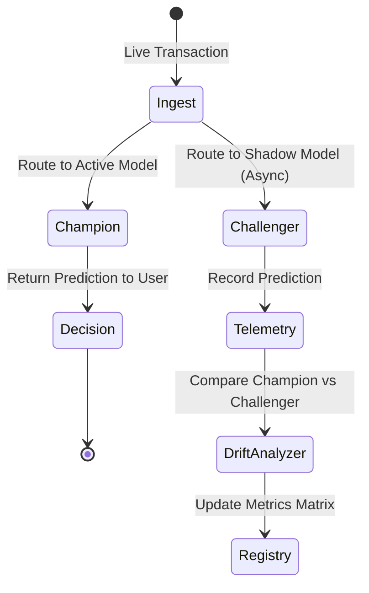
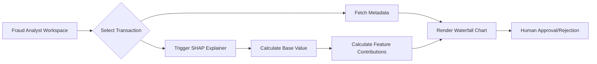
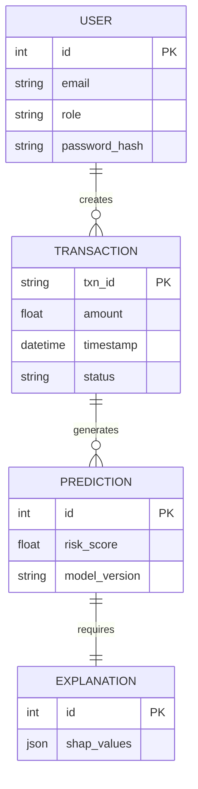

# FraudShield AI: System Architecture Diagrams

This document contains high-fidelity Mermaid.js diagrams representing the internal architecture, data flow, and deployment topology of FraudShield AI.

## 1. High-Level System Architecture

## 2. Authentication Flow (Sequence Diagram)

## 3. Champion vs Challenger MLOps Workflow

## 4. Explainability Studio (Activity Diagram)

## 5. Entity Relationship (ER) Diagram

